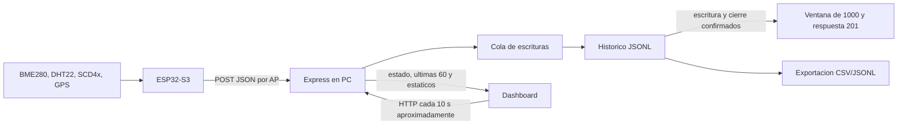

# Arquitectura del sistema local

El ESP32-S3 toma lecturas y crea una red Wi-Fi AP. El PC conectado ejecuta
Express y recibe POST; el navegador consulta ese mismo servidor. El firmware
debe apuntar a la IP del PC en la red del AP, no a localhost.

## Responsabilidades

| Zona | Responsabilidad |
| --- | --- |
| firmware/EstacionMeteorologica/config.h | Red, pines, intervalos y umbrales |
| firmware/EstacionMeteorologica/EstacionMeteorologica.ino | Sensores, fusion, filtro y POST |
| firmware/EstacionMeteorologica/sketch.yaml | Perfil de compilacion fijado |
| backend/servers/ | Arranque comun y entradas dev/ESP32 |
| backend/src/app.js | Ensamblado Express, rutas, middleware y estaticos |
| backend/src/config.js, validation.js, errors.js | Defaults, contrato y errores JSON |
| backend/src/store.js | Recarga, cola, ID, escritura y memoria |
| backend/src/anomalias.js | Saltos entre muestras confirmadas |
| backend/src/export.js, pagination.js | Historico completo o paginas de memoria |
| backend/src/logger.js | Eventos JSON por nivel, sin volcar payloads |
| backend/frontend/assets/js/ | Consultas, estado, render, graficos y exportacion |

## Tiempos y ausencia de lecturas

Defaults del firmware: lectura cada 2 s, agregacion/envio cada 20 s y espera
inicial de 10 s. El GPS se atiende en el bucle; operaciones bloqueantes y descartes
por saltos pueden alterar la recepcion efectiva. No cambiar la cadencia fisica
para corregir una etiqueta o un comentario.

Los campos ambientales requeridos admiten null; CO2=0 conserva ausencia de
muestras. GPS puede enviar coordenadas null y cero satelites. El backend valida
tipos/rangos nuevos y genera metadatos. El dashboard interpreta la ultima muestra,
no la salud actual de todos los sensores: DHT22 no tiene dato independiente.
Vigencia mayor de 90 s o fecha no verificable se indica; desconexion conserva
valores previos con aviso. Grafico: 60 muestras, no una duracion fija.

## Datos y limites

La recarga inicial lee todo el JSONL, ignora lineas corruptas/arrays/primitivos
y retiene objetos sin aplicar retroactivamente los rangos nuevos de POST.
La ventana devuelve por insercion; ID nuevo supera conteo y maximo ID positivo
seguro. Exportacion recorre el archivo completo y filtra fechas inclusivamente.

La cola calcula ID/anomalias y completa escritura/cierre antes de publicar en
memoria y responder 201. Fallo intenta restaurar tamano previo; restauracion
fallida bloquea ingesta hasta revisar el archivo y reiniciar. Hay un solo escritor
por DATA_FILE; no fsync, locks entre procesos, deduplicacion o garantia ante un
corte a mitad de escritura. Detalle de contrato y errores en [backend](backend/README.md).

Dev y ESP32 comparten archivo por defecto; usar DATA_FILE temporal para pruebas.
No hay WebSocket, almacenamiento externo ni API publica autenticada en este flujo.
El firmware no implementa reintento durable; comprobar perdida de entregas en la
prueba fisica. Compilacion reproducible no sustituye montaje, carga y ensayo de red.

## Reproduccion

- [Backend y pruebas](backend/README.md)
- [Compilacion, pines y carga del firmware](firmware/README.md)
- [Operacion local](manual-de-usuario.md)
- [Contribuciones](CONTRIBUTING.md)
