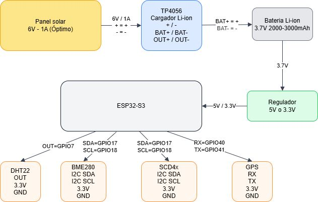

# Estacion meteorologica

Proyecto universitario de una estacion meteorologica y de calidad del aire de bajo costo. Usa un ESP32-S3 para capturar mediciones (temperatura, humedad, presion y CO2), un backend Node.js para recibir y almacenar datos, y una interfaz web simple para visualizarlos. Incluye documentacion tecnica, manual de usuario e informe en LaTeX.

## Documentacion

- [manual-de-usuario.md](manual-de-usuario.md): instrucciones completas de uso
- [backend/README.md](backend/README.md): endpoints, exportacion y ejecucion
- [firmware/README.md](firmware/README.md): cableado, sensores y configuracion
- [docs/README.md](docs/README.md): documentacion del informe
- [diagramas/circuito.drawio](diagramas/circuito.drawio): circuito del prototipo

## Inicio rapido

1) Backend y pagina web
- Ver [backend/README.md](backend/README.md)

2) Firmware
- Ver [firmware/README.md](firmware/README.md)

## Estructura

- [backend/](backend/): servidor Node.js, API y pagina web
- [firmware/](firmware/): codigo del ESP32-S3 (Arduino)
- [docs/informe/](docs/informe/): informe en LaTeX
- [diagramas/](diagramas/): diagramas editables (drawio)
- [manual-de-usuario.md](manual-de-usuario.md): guia de uso para usuarios finales

## Estructura del informe

- docs/informe/informe.tex: fuente principal del informe
- docs/informe/logos.sty: estilo y encabezados
- docs/informe/figuras/: figuras del informe
- docs/informe/compile-informe.bat: compilacion automatizada en Windows

## Circuito

