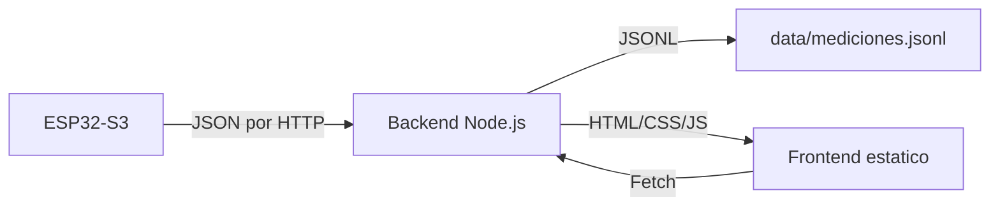

# Backend y frontend

Este backend es el punto de encuentro entre la estacion y el usuario: recibe mediciones del ESP32, las guarda en un historico y expone una pagina web estatica para visualizarlas. Tambien provee una API simple para consultar el estado y los datos recientes.

Ver tambien:
- [manual-de-usuario.md](../manual-de-usuario.md)
- [firmware/README.md](../firmware/README.md)
- [diagramas/circuito.jpg](../diagramas/circuito.jpg)



## Para que sirve

- Centraliza las mediciones de la estacion en un solo lugar.
- Permite ver datos en tiempo real desde el navegador.
- Facilita la integracion con otras herramientas via API.

## Requisitos

- Node.js 18+ recomendado

## Ejecutar

- npm install
- npm run start:esp32
- Abrir http://localhost:3001/

Servidor de pruebas local:

- npm run start:dev
- Abrir http://localhost:3002/

Scripts rapidos (Windows):

- run-esp32.bat (instala dependencias si faltan y abre http://localhost:3001/)
- run-dev.bat (instala dependencias si faltan y abre http://localhost:3002/)

## Estructura de carpetas

```
backend/
  data/
    mediciones.jsonl
  frontend/
    index.html
    assets/
      css/
      js/
    img/
  servers/
    esp32.js
    dev.js
  src/
    app.js
  run-esp32.bat
  run-dev.bat
  package.json
  README.md
```

- data/: historico en formato JSONL, una medicion por linea.
- frontend/: pagina estatica con la vista de datos.
- servers/: entradas del servidor (ESP32 y pruebas locales).
- src/: logica compartida del backend.

## Datos

- Archivo: data/mediciones.jsonl
- Formato: una medicion JSON por linea

Campos esperados en la medicion:
- temperatura_aire_celsius
- incertidumbre_temperatura_celsius
- humedad_aire_porcentaje
- incertidumbre_humedad_porcentaje
- presion_atmosferica_hPa
- concentracion_CO2_ppm
- latitud_grados
- longitud_grados
- numero_satelites

El backend agrega:
- id
- timestamp
- sospechosa
- motivos_sospecha

## API

- GET /api/status
- GET /api/mediciones
- GET /api/mediciones?limit=60
- GET /api/mediciones/ultimo
- GET /api/mediciones/export?format=csv|jsonl&from=ISO&to=ISO
- POST /api/mediciones

Nota: el backend mantiene una ventana de mediciones en memoria para respuestas rapidas. El conteo total refleja todo lo guardado en JSONL.

## Ejemplos

Estado del servidor:

```bash
curl http://localhost:3001/api/status
```

Ultima medicion:

```bash
curl http://localhost:3001/api/mediciones/ultimo
```

Ultimas 60 mediciones:

```bash
curl "http://localhost:3001/api/mediciones?limit=60"
```

Exportar CSV (compatible con Excel):

```bash
curl -o mediciones.csv "http://localhost:3001/api/mediciones/export?format=csv"
```

Exportar CSV por rango de fechas (ISO 8601):

```bash
curl -o mediciones.csv "http://localhost:3001/api/mediciones/export?format=csv&from=2026-02-10T00:00:00Z&to=2026-02-10T23:59:59Z"
```

Exportar JSONL completo:

```bash
curl -o mediciones.jsonl "http://localhost:3001/api/mediciones/export?format=jsonl"
```

Exportar JSONL por rango de fechas (ISO 8601):

```bash
curl -o mediciones.jsonl "http://localhost:3001/api/mediciones/export?format=jsonl&from=2026-02-10T00:00:00Z&to=2026-02-10T23:59:59Z"
```

Enviar una medicion (el backend agrega id y timestamp):

```bash
curl -X POST http://localhost:3001/api/mediciones \
  -H "Content-Type: application/json" \
  -d "{\"temperatura_aire_celsius\":24.3,\"incertidumbre_temperatura_celsius\":0.2,\"humedad_aire_porcentaje\":55.1,\"incertidumbre_humedad_porcentaje\":1.0,\"presion_atmosferica_hPa\":1012.4,\"concentracion_CO2_ppm\":580,\"latitud_grados\":-32.9,\"longitud_grados\":-60.7,\"numero_satelites\":7}"
```

Ejemplo de linea en JSONL (data/mediciones.jsonl):

```json
{"id":128,"timestamp":"2026-02-10T18:40:12.532Z","temperatura_aire_celsius":24.3,"incertidumbre_temperatura_celsius":0.2,"humedad_aire_porcentaje":55.1,"incertidumbre_humedad_porcentaje":1.0,"presion_atmosferica_hPa":1012.4,"concentracion_CO2_ppm":580,"latitud_grados":-32.9,"longitud_grados":-60.7,"numero_satelites":7}
```

## FAQ

- Por que no veo datos nuevos en la pagina? Verifica que el ESP32 este enviando al endpoint correcto y que el backend este activo.
- Donde se guardan las mediciones? En data/mediciones.jsonl, una por linea.
- Puedo integrar otro cliente? Si, consume la API REST o lee el JSONL.
- El backend agrega datos? Si, agrega id y timestamp a cada medicion.
