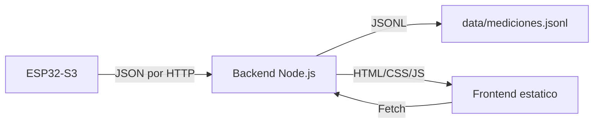

# Backend y frontend

[](https://github.com/NicoCG32/Estacion-Meteorologica/actions/workflows/lint.yml)
[](#cobertura-del-backend)

Este backend es el punto de encuentro entre la estacion y el usuario: recibe mediciones del ESP32, las guarda en un historico y expone una pagina web estatica para visualizarlas. Tambien provee una API simple para consultar el estado y los datos recientes.

Ver tambien:

- [manual-de-usuario.md](../manual-de-usuario.md)
- [firmware/README.md](../firmware/README.md)
- [diagramas/circuito.jpg](../diagramas/circuito.jpg)


```mermaid
flowchart LR
    ESP32[ESP32-S3] -->|JSON por HTTP| API[Backend Node.js]
    API -->|JSONL| DATA[data/mediciones.jsonl]
    API -->|HTML/CSS/JS| WEB[Frontend estatico]
    WEB -->|Fetch| API
```

## Para que sirve

- Centraliza las mediciones de la estacion en un solo lugar.
- Permite ver datos en tiempo real desde el navegador.
- Facilita la integracion con otras herramientas via API.

## Requisitos

- Node.js 24 LTS; version reproducible: 24.21.0, fijada en `.nvmrc` en la raiz.
- npm incluido con Node.js. El backend declara `>=24.21.0 <25` en `engines`.

## Ejecutar

Desde `backend/`, instalar las versiones fijadas en el lockfile:

```powershell
npm ci
npm run start:esp32
```

Abrir http://localhost:3001/. `npm start` inicia el mismo modo.

Servidor de pruebas local:

```powershell
npm run start:dev
```

Abrir http://localhost:3002/.

### Variables de entorno

Los tres scripts cargan `.env` si existe, usando la opcion nativa de Node
`--env-file-if-exists`. No se requiere una dependencia adicional. Desde `backend/`:

```powershell
Copy-Item .env.example .env
```

Descomentar y ajustar solo las variables necesarias antes de iniciar:

| Variable  | Sin configurar                       | Uso                                                                                               |
| --------- | ------------------------------------ | ------------------------------------------------------------------------------------------------- |
| PORT      | 3001 para start/esp32; 3002 para dev | Puerto HTTP; definirlo reemplaza el valor en ambos modos                                          |
| HOST      | 0.0.0.0                              | 127.0.0.1 limita a este PC; para ESP32 usar la interfaz de red del PC o 0.0.0.0                   |
| DATA_FILE | backend/data/mediciones.jsonl        | Archivo JSONL; una ruta relativa se resuelve desde el directorio de trabajo (backend con npm run) |
| LOG_LEVEL | info                                 | Nivel de logs JSON: silent, error, warn, info o debug                                             |

Las variables del proceso tienen prioridad sobre `.env`. El ejemplo deja los
valores comentados para conservar los puertos originales de cada modo.
Dev y estacion comparten el historico por defecto; para pruebas definir DATA_FILE
con otro archivo, preferentemente mediante una ruta absoluta. No usar el historico
versionado para ingesta de muestras de prueba.

Los comandos directos `node servers/dev.js` y `node servers/esp32.js` solo leen
las variables del proceso; utilizar los scripts npm para cargar `.env`.

Scripts rapidos (Windows):

- run-esp32.bat (ejecuta npm ci si faltan dependencias y abre http://localhost:3001/)
- run-dev.bat (ejecuta npm ci si faltan dependencias y abre http://localhost:3002/)

Los accesos rapidos abren los puertos predeterminados; si cambias PORT, abrir
manualmente la URL con el puerto configurado.

## Calidad de codigo

Desde `backend/`, con dependencias de desarrollo instaladas por `npm ci`:

```powershell
npm run lint
npm run format:check
npm test
npm run test:coverage
```

ESLint revisa JavaScript del servidor como CommonJS y JavaScript del navegador
como script con sus propias variables globales. Los avisos hacen fallar el comando.
Prettier comprueba el formato de JavaScript, CSS, HTML, JSON y Markdown en backend.
Para aplicarlo:

```powershell
npm run format
```

La configuracion vive en `.prettierrc` y `.prettierignore` de la raiz y en
`backend/eslint.config.cjs`. Datos, imagenes, archivos .env, lockfile, dependencias
y scripts .bat quedan fuera del formateo. El firmware no forma parte de estos comandos.

`.gitattributes` mantiene LF en los archivos de texto de estas herramientas y
CRLF en los scripts .bat, incluso si la configuracion local de Git usa autocrlf.

El workflow `.github/workflows/lint.yml` ejecuta instalacion limpia, lint,
comprobacion de formato y pruebas con cobertura en push y pull request, usando
la version de `.nvmrc`. El badge de CI refleja las ejecuciones publicadas de main;
comprobar la ejecucion correspondiente al commit que se desea revisar.

Las pruebas usan el runner nativo de Node.js, sin dependencias adicionales.
Cubren los cinco endpoints, persistencia en archivos temporales, ventana de
memoria, exportaciones CSV/JSONL y limites de deteccion de anomalias. No escriben
en el historico versionado. Para repetirlas al editar:

```powershell
npm run test:watch
```

La suite incluye validacion de tipos/rangos, errores JSON, fallos de escritura y
restauracion, concurrencia, recarga, paginacion y niveles de logging. Comprueba
que un 201 ya tenga su linea completa en el archivo, sin reintentos en la prueba.

### Cobertura del backend

`npm run test:coverage` usa la cobertura experimental del runner nativo de Node,
con version fijada, y ejecuta las mismas pruebas. Mide exclusivamente los once
modulos actuales de `src/**/*.js`, incluidas las rutas. Excluye dependencias,
pruebas, herramientas, frontend y firmware. Los arranques tienen pruebas de
proceso, pero no forman parte de este porcentaje.

Minimos globales en `coverage.config.json`: **95% lineas, 90% ramas y 95%
funciones**. El comando falla si no alcanza esos valores, si falla una prueba o
si un modulo de src/ no aparece en el informe. El badge local indica la politica
minima; no es un porcentaje medido de un commit antiguo.

Salidas regeneradas en `coverage/`, ignoradas por Git, Prettier y ESLint:

- `lcov.info`: detalle por linea/funcion/rama para herramientas compatibles.
- `summary.json`: metricas por modulo, totales y ramas no cubiertas.
- `badge.svg`: porcentaje de lineas medido en esa ejecucion.

CI incluye metricas en el resumen de la ejecucion y conserva esas salidas en el
artefacto `backend-coverage` durante 14 dias, tambien como diagnostico cuando
existen informes de una ejecucion fallida. No se envia cobertura a servicios externos.
La cobertura no demuestra todos los comportamientos: errores de E/S, concurrencia
y contratos se comprueban con aserciones especificas sobre archivos temporales.

## Estructura de carpetas

```
backend/
  data/
    mediciones.jsonl
  frontend/
    index.html
    assets/
      css/
      js/
        app.js
        api.mjs
        state.mjs
        render.mjs
        charts.mjs
        export-controls.mjs
    img/
  servers/
    esp32.js
    dev.js
    start.js
  src/
    app.js
    config.js
    store.js
    export.js
    anomalias.js
    validation.js
    errors.js
    pagination.js
    logger.js
    routes/
      mediciones.js
      status.js
  test/
    api.test.js
    anomalias.test.js
    export.test.js
    startup.test.js
    validation.test.js
    errors.test.js
    persistence.test.js
    pagination.test.js
    logger.test.js
    stream-export.test.js
    storage-boundaries.test.js
    frontend.test.js
    helpers.cjs
  scripts/
    test-coverage.cjs
    coverage-reporter.cjs
  docs/
    coverage-policy.svg
  coverage.config.json
  run-esp32.bat
  run-dev.bat
  package.json
  README.md
```

- data/: historico en formato JSONL, una medicion por linea.
- frontend/: pagina estatica con la vista de datos.
- servers/: entradas ESP32/dev y arranque comun, conservando puertos y variables.
- src/app.js: ensamblado de Express, middleware y recursos estaticos.
- src/config.js: rutas predeterminadas, campos, cabeceras CSV y umbrales.
- src/store.js: carga JSONL, ventana, conteo y cola de escrituras confirmadas.
- src/export.js: escapado CSV, filtrado de fechas y streaming CSV/JSONL.
- src/anomalias.js: evaluacion de saltos entre mediciones.
- src/validation.js: campos permitidos, tipos y limites de admision.
- src/errors.js: errores HTTP y middleware de respuestas JSON.
- src/pagination.js: seleccion de paginas recientes y orden de salida.
- src/logger.js: eventos JSON y filtrado por LOG_LEVEL, sin cuerpos de mediciones.
- src/routes/: endpoints de estado e ingesta/consulta/exportacion.
- test/: caracterizacion HTTP y pruebas unitarias.

## Dashboard

Modulos nativos del navegador, sin build adicional: app.js coordina sondeos;
api.mjs consulta y valida respuestas con plazo de 5 s; state.mjs conserva datos
y vigencia; render.mjs actualiza textos/indicadores; charts.mjs dibuja canvas;
export-controls.mjs valida fechas y enlaces de descarga.

La consulta se repite aproximadamente cada 10 s, sin peticiones solapadas, y
**Actualizar ahora** permite reintentar. Se muestran carga, vacio, consulta
fallida, fechas no verificables y datos de mas de 90 s. Ante error se mantienen
los ultimos valores, identificados como anteriores, y los sensores quedan sin
vigencia comprobada. Una respuesta del servidor o una muestra reciente no es un
diagnostico directo del hardware. DHT22 permanece no observable individualmente.

Los graficos conservan las ultimas 60 mediciones por ID/timestamp completo,
sin repetir un punto por cada consulta. Ausencias y CO2=0 dejan huecos en el
trazo; no se representan como lecturas ambientales. Los controles de fechas
bloquean rangos invertidos, tambien al activar el enlace con el teclado.

## Datos

- Archivo: data/mediciones.jsonl
- Formato: una medicion JSON por linea

Campos esperados en la medicion:

- temperatura_aire_celsius
- incertidumbre_temperatura_celsius
- humedad_aire_porcentaje
- incertidumbre_humedad_porcentaje
- presion_atmosferica_hPa
- concentracion_CO2_ppm
- latitud_grados
- longitud_grados
- numero_satelites

El backend agrega:

- id
- timestamp
- sospechosa
- motivos_sospecha

### Contrato de ingesta

POST requiere `Content-Type: application/json` y un objeto de hasta 100kb.
Temperatura, humedad, presion y CO2 son campos obligatorios; los otros campos
de sensores son opcionales. Todos admiten `null` como ausencia de lectura.
CO2 tambien conserva `0` como ausencia de muestras del firmware; no participa
en la deteccion de saltos cuando la lectura actual o anterior es 0.

Los numeros deben ser finitos, sin conversion desde strings. Limites inclusivos
de admision del servidor (no indican precision ni calibracion):

| Campo                             | Minimo | Maximo |
| --------------------------------- | -----: | -----: |
| temperatura_aire_celsius          |    -50 |     85 |
| incertidumbre_temperatura_celsius |      0 |    135 |
| humedad_aire_porcentaje           |      0 |    100 |
| incertidumbre_humedad_porcentaje  |      0 |    100 |
| presion_atmosferica_hPa           |    300 |   1200 |
| concentracion_CO2_ppm             |      0 |  40000 |
| latitud_grados                    |    -90 |     90 |
| longitud_grados                   |   -180 |    180 |
| numero_satelites (entero)         |      0 |    255 |

Solo se aceptan esos nueve campos. El servidor genera `id`, `timestamp`,
`sospechosa` y, si corresponde, `motivos_sospecha`. Enviar metadatos o campos
extra devuelve 400 con `campos_no_permitidos`; campos ausentes se enumeran en
`campos_faltantes` y valores invalidos en `errores`.

## API

- GET /api/status
- GET /api/mediciones
- GET /api/mediciones?limit=60
- GET /api/mediciones?limit=60&offset=60&order=desc
- GET /api/mediciones/ultimo
- GET /api/mediciones/export?format=csv|jsonl&from=ISO&to=ISO
- POST /api/mediciones

Nota: el backend mantiene una ventana de mediciones en memoria para respuestas
rapidas. El conteo incluye los objetos JSON cargados y las escrituras confirmadas.
Las lineas corruptas, arrays y primitivos se ignoran al cargar/exportar; los
objetos historicos se conservan sin aplicar retroactivamente los rangos de POST.

`limit` es un entero positivo; `offset` es un entero no negativo que omite esa
cantidad de registros desde los mas recientes. Se selecciona una pagina de la
ventana en memoria. `order=asc` (predeterminado) la devuelve por insercion de
antigua a reciente; `order=desc` invierte esa pagina. No ordena por ID ni timestamp.
`?limit=60` conserva las ultimas 60 en orden de insercion. Offset fuera de la
ventana retorna `[]`; no permite recorrer todo el historico, que se obtiene por exportacion.

Filtros `from`/`to` inclusivos: fecha `YYYY-MM-DD` (medianoche UTC), o fecha/hora
ISO con segundos y zona (`Z` o offset). Una fecha sin hora en `to` tambien es
medianoche, no el final del dia. Fechas invalidas, repetidas y rangos invertidos
devuelven 400.

### Persistencia y errores

Cada proceso debe ser el unico escritor de su DATA_FILE. La cola serializa el
calculo de ID/anomalias y la escritura; el siguiente ID supera el conteo y los
ID enteros positivos del archivo. Un 201 confirma escritura y cierre completos
antes de actualizar memoria, conteo y ultima medicion.

Si falla, responde 500 sin avanzar memoria ni ID. Una escritura parcial se
intenta revertir al tamano anterior. Si esa restauracion falla, responde 503 y
bloquea mas ingesta en esa instancia: revisar/restaurar el archivo antes de
reiniciar. La lectura permanece disponible. No se realiza `fsync`: escritura
confirmada no garantiza persistencia ante corte de energia o caida del proceso
durante una escritura. No hay bloqueo entre procesos ni deduplicacion de reintentos.

Errores API usan `{ "ok": false, "mensaje": "..." }`, con detalle de validacion
cuando corresponde. JSON malformado: 400; cuerpo excesivo: 413; tipo de contenido
incorrecto: 415; ruta API inexistente: 404; fallo interno: 500. No se devuelven
stack traces ni rutas internas en errores. Si una exportacion falla tras empezar
a transmitir, se interrumpe la conexion; el cliente debe descartar esa descarga.

Logs: una linea JSON por evento con timestamp, level y event. Se registran
estado/duracion de solicitudes e ID/conteo de ingesta, sin payload completo ni
query string. LOG_LEVEL filtra desde error hasta debug; silent elimina la salida.

## Ejemplos

Estado del servidor:

```bash
curl http://localhost:3001/api/status
```

Ultima medicion:

```bash
curl http://localhost:3001/api/mediciones/ultimo
```

Ultimas 60 mediciones:

```bash
curl "http://localhost:3001/api/mediciones?limit=60"
```

Exportar CSV (compatible con Excel):

```bash
curl -o mediciones.csv "http://localhost:3001/api/mediciones/export?format=csv"
```

Exportar CSV por rango de fechas (ISO 8601):

```bash
curl -o mediciones.csv "http://localhost:3001/api/mediciones/export?format=csv&from=2026-02-10T00:00:00Z&to=2026-02-10T23:59:59Z"
```

Exportar JSONL completo:

```bash
curl -o mediciones.jsonl "http://localhost:3001/api/mediciones/export?format=jsonl"
```

Exportar JSONL por rango de fechas (ISO 8601):

```bash
curl -o mediciones.jsonl "http://localhost:3001/api/mediciones/export?format=jsonl&from=2026-02-10T00:00:00Z&to=2026-02-10T23:59:59Z"
```

Enviar una medicion (el backend agrega id y timestamp):

```bash
curl -X POST http://localhost:3001/api/mediciones \
  -H "Content-Type: application/json" \
  -d "{\"temperatura_aire_celsius\":24.3,\"incertidumbre_temperatura_celsius\":0.2,\"humedad_aire_porcentaje\":55.1,\"incertidumbre_humedad_porcentaje\":1.0,\"presion_atmosferica_hPa\":1012.4,\"concentracion_CO2_ppm\":580,\"latitud_grados\":-32.9,\"longitud_grados\":-60.7,\"numero_satelites\":7}"
```

Ejemplo de linea en JSONL (data/mediciones.jsonl):

```json
{
  "id": 128,
  "timestamp": "2026-02-10T18:40:12.532Z",
  "temperatura_aire_celsius": 24.3,
  "incertidumbre_temperatura_celsius": 0.2,
  "humedad_aire_porcentaje": 55.1,
  "incertidumbre_humedad_porcentaje": 1.0,
  "presion_atmosferica_hPa": 1012.4,
  "concentracion_CO2_ppm": 580,
  "latitud_grados": -32.9,
  "longitud_grados": -60.7,
  "numero_satelites": 7
}
```

## FAQ

- Por que no veo datos nuevos en la pagina? Verifica que el ESP32 este enviando al endpoint correcto y que el backend este activo.
- Donde se guardan las mediciones? En data/mediciones.jsonl, una por linea.
- Puedo integrar otro cliente? Si, consume la API REST o lee el JSONL.
- El backend agrega datos? Si, agrega id y timestamp a cada medicion.
