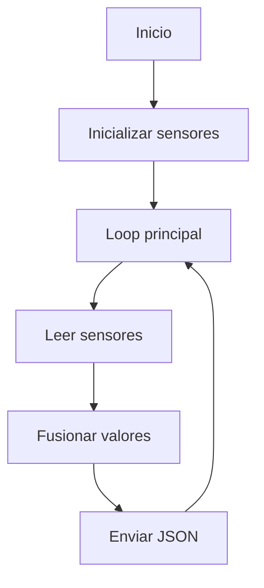

# Firmware ESP32-S3

Este firmware corre en el ESP32-S3 y es el encargado de obtener las mediciones fisicas. Lee los sensores, fusiona los valores y envia un JSON al backend a intervalos regulares.

Ver tambien:
- [manual-de-usuario.md](../manual-de-usuario.md)
- [backend/README.md](../backend/README.md)
- [diagramas/circuito.drawio](../diagramas/circuito.drawio)



## Para que sirve

- Captura datos ambientales con la instrumentacion de la estacion.
- Publica las mediciones al backend sin intervencion del usuario.
- Mantiene el ciclo de muestreo y envio configurable.

## Sensores usados

- BME280 (temperatura, humedad, presion) por I2C
- DHT22 (temperatura, humedad) por GPIO
- SCD4x (CO2, temperatura, humedad) por I2C
- Modulo GPS (UART)

## Pines

- SDA: GPIO 17
- SCL: GPIO 18
- DHT22 DATA: GPIO 7
- GPS RX: GPIO 40
- GPS TX: GPIO 41

## Estructura de carpetas

```
firmware/
  EstacionMeteorologica.ino
  README.md
```

- EstacionMeteorologica.ino: logica de sensores y envio de datos.

## Configuracion clave

En firmware/EstacionMeteorologica.ino:
- AP_SSID / AP_PASS: red Wi-Fi creada por el ESP32
- BACKEND_URL: URL del backend (PC conectado al AP)
- INTERVALO_MEDIDA_MS: lectura de sensores
- INTERVALO_JSON_MS: envio de mediciones

Ejemplo de configuracion:

```cpp
const char* AP_SSID = "Estacion-Meteo";
const char* AP_PASS = "clave-segura";
const char* BACKEND_URL = "http://192.168.4.2:3001/api/mediciones";
const unsigned long INTERVALO_MEDIDA_MS = 2000;
const unsigned long INTERVALO_JSON_MS = 10000;
```

## Carga del firmware

1) Abrir el .ino en Arduino IDE
2) Seleccionar placa ESP32-S3
3) Compilar y cargar

## Ejemplo de payload

JSON que envia el ESP32 al backend:

```json
{"temperatura_aire_celsius":24.3,"incertidumbre_temperatura_celsius":0.2,"humedad_aire_porcentaje":55.1,"incertidumbre_humedad_porcentaje":1.0,"presion_atmosferica_hPa":1012.4,"concentracion_CO2_ppm":580,"latitud_grados":-32.9,"longitud_grados":-60.7,"numero_satelites":7}
```

## FAQ

- No envia datos al backend, que reviso? Verifica BACKEND_URL y que el PC este conectado al AP del ESP32.
- Los sensores no responden? Revisa cableado I2C y los pines configurados.
- El GPS no fija satelites? Asegura vista al cielo y espera el primer fix.
- Puedo cambiar los intervalos? Si, ajusta INTERVALO_MEDIDA_MS y INTERVALO_JSON_MS.
