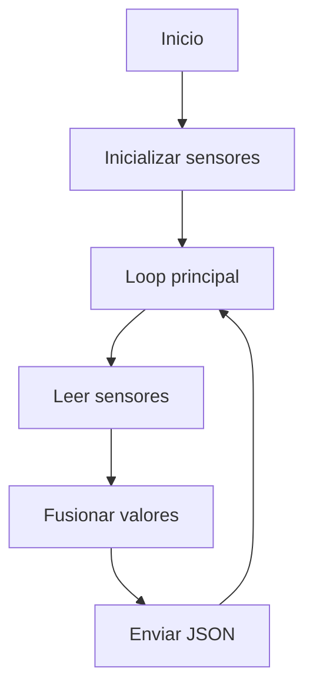

# Firmware ESP32-S3

Este firmware corre en el ESP32-S3 y es el encargado de obtener las mediciones fisicas. Lee los sensores, fusiona los valores y envia un JSON al backend a intervalos regulares.

Ver tambien:
- [manual-de-usuario.md](../manual-de-usuario.md)
- [backend/README.md](../backend/README.md)
- [diagramas/circuito.jpg](../diagramas/circuito.jpg)


```mermaid
flowchart TD
    START[Inicio] --> INIT[Inicializar sensores]
    INIT --> LOOP[Loop principal]
    LOOP --> READ[Leer sensores]
    READ --> FUSE[Fusionar valores]
    FUSE --> SEND[Enviar JSON]
    SEND --> LOOP
```

## Para que sirve

- Captura datos ambientales con la instrumentacion de la estacion.
- Publica las mediciones al backend sin intervencion del usuario.
- Mantiene el ciclo de muestreo y envio configurable.

## Sensores usados

- BME280 (temperatura, humedad, presion) por I2C
- DHT22 (temperatura, humedad) por GPIO
- SCD4x (CO2, temperatura, humedad) por I2C
- Modulo GPS (UART)

## Pines

- SDA: GPIO 17
- SCL: GPIO 18
- DHT22 DATA: GPIO 7
- GPS RX: GPIO 40
- GPS TX: GPIO 41

## Estructura de carpetas

```
firmware/
  EstacionMeteorologica/
    EstacionMeteorologica.ino
    config.h
    sketch.yaml
  README.md
```

- EstacionMeteorologica/EstacionMeteorologica.ino: logica de sensores y envio.
- config.h: red, pines, intervalos y umbrales.
- sketch.yaml: perfil reproducible de placa/core/librerias.

## Configuracion clave

En [EstacionMeteorologica/config.h](EstacionMeteorologica/config.h):
- AP_SSID / AP_PASS: red Wi-Fi creada por el ESP32
- BACKEND_URL: URL del backend (PC conectado al AP)
- INTERVALO_MEDIDA_MS: lectura de sensores
- INTERVALO_JSON_MS: envio de mediciones

Ejemplo de configuracion:

```cpp
const char* AP_SSID = "Estacion-Meteo";
const char* AP_PASS = "clave-segura";
const char* BACKEND_URL = "http://192.168.4.2:3001/api/mediciones";
const unsigned long INTERVALO_MEDIDA_MS = 2000;
const unsigned long INTERVALO_JSON_MS = 20000;
```

Filtro de cambios bruscos (firmware):

- Temperatura: 5.0 C
- Humedad: 15.0 %
- Presion: 5.0 hPa
- CO2: 400 ppm

Se descarta el envio si el cambio absoluto respecto de la ultima referencia
alcanza cualquiera de esos umbrales.

## Carga del firmware

El sketch vive en una carpeta con su mismo nombre, compatible con Arduino IDE/CLI:

```text
firmware/EstacionMeteorologica/
  EstacionMeteorologica.ino
  config.h
  sketch.yaml
```

El perfil `esp32s3` de [sketch.yaml](EstacionMeteorologica/sketch.yaml) fija el
entorno que se compilo con Arduino CLI **1.5.1**:

| Componente | Version |
| --- | --- |
| Core Espressif ESP32 | 3.3.12 |
| Placa/FQBN de compilacion | esp32:esp32:esp32s3 (ESP32S3 Dev Module) |
| Adafruit BME280 Library | 2.3.0 |
| Adafruit Unified Sensor | 1.1.15 |
| Adafruit BusIO | 1.17.4 |
| DHT sensor library | 1.4.7 |
| Sensirion I2C SCD4x | 1.1.0 |
| Sensirion Core | 0.7.3 |
| TinyGPSPlus | 1.0.3 |

Desde la raiz del repositorio, con Arduino CLI instalado:

```powershell
arduino-cli compile --profile esp32s3 firmware/EstacionMeteorologica
```

El perfil descarga las versiones fijadas y compila sin conectar ni cargar el
dispositivo. En Windows, usar rutas cortas para el directorio de datos de Arduino
y el de compilacion si la herramienta no encuentra `bits/c++config.h`: se observo
ese problema con una ruta temporal larga, y la compilacion paso con rutas cortas.
Se pueden configurar los directorios mediante `arduino-cli.yaml` y `--config-file`.

En Arduino IDE, abrir el .ino dentro de esa carpeta y seleccionar el core y
librerias de la tabla. El perfil generico valida compilacion, no identifica las
opciones USB, flash o PSRAM de la placa fisica: confirmar el modelo y esas opciones
antes de cargar. Seleccionar su puerto y cargar manualmente. No se ha realizado
una carga o prueba fisica durante esta estandarizacion.

Despues de cargar, comprobar Serial a 115200, auto-test de sensores, GPS a 9600,
conexion del PC al AP, IP del PC en BACKEND_URL y recepcion de POST en un DATA_FILE
de prueba. El muestreo predeterminado es 2 s y la agregacion/envio 20 s; filtros o
fallos pueden impedir que llegue una nueva medicion en cada intervalo.

## Ejemplo de payload

JSON que envia el ESP32 al backend:

```json
{"temperatura_aire_celsius":24.3,"incertidumbre_temperatura_celsius":0.2,"humedad_aire_porcentaje":55.1,"incertidumbre_humedad_porcentaje":1.0,"presion_atmosferica_hPa":1012.4,"concentracion_CO2_ppm":580,"latitud_grados":-32.9,"longitud_grados":-60.7,"numero_satelites":7}
```

## FAQ

- No envia datos al backend, que reviso? Verifica BACKEND_URL y que el PC este conectado al AP del ESP32.
- Los sensores no responden? Revisa cableado I2C y los pines configurados.
- El GPS no fija satelites? Asegura vista al cielo y espera el primer fix.
- Puedo cambiar los intervalos? Si, ajusta INTERVALO_MEDIDA_MS y INTERVALO_JSON_MS.
